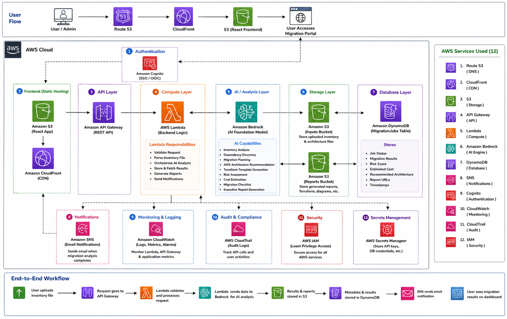

# 🚀 AI-Powered Pega Migration Assistant

> AI-powered automation platform for assessing and planning the migration of Pega applications to AWS.

---

## 📖 Overview

This project is a Hackathon Proof of Concept (POC) that automates the assessment phase of migrating Pega applications to AWS.

The platform allows users to upload a Pega inventory file, analyzes it using Amazon Bedrock AI, and automatically generates:

- ✅ Migration Assessment
- ✅ AWS Architecture Recommendation
- ✅ Risk Analysis
- ✅ Cost Estimation
- ✅ Terraform Starter Code
- ✅ Migration Checklist
- ✅ Executive Report

---

## 🏗 Architecture Diagram



---

## 🔄 Workflow

```
User
   │
Upload Inventory
   │
React Portal
   │
API Gateway
   │
Lambda
   │
Amazon Bedrock
   │
S3 + DynamoDB
   │
Dashboard Output
```

---

## ☁ AWS Services Used

| Service | Purpose |
|----------|---------|
| Amazon Route53 | DNS |
| Amazon CloudFront | CDN |
| Amazon S3 | Frontend & File Storage |
| Amazon API Gateway | REST APIs |
| AWS Lambda | Backend Compute |
| Amazon Bedrock | AI Engine |
| Amazon DynamoDB | Migration Results |
| Amazon SNS | Notifications |
| Amazon Cognito | Authentication |
| Amazon CloudWatch | Monitoring |
| AWS CloudTrail | Auditing |
| AWS IAM | Security |

---

## 📂 Project Structure

```
AI-Pega-Migration-Assistant/

frontend/

backend/

terraform/

docs/

sample-files/
```

---

## ⚙ Technology Stack

- React
- AWS Lambda
- Amazon Bedrock
- API Gateway
- Amazon S3
- Amazon DynamoDB
- Terraform
- GitHub
- AWS CloudWatch

---

## 🎯 POC Features

- Upload Pega Inventory
- AI-Based Dependency Analysis
- Migration Recommendation
- Risk Score
- Cost Estimation
- Terraform Generation
- Migration Checklist
- Executive Report

---

## 🚀 Future Scope

- AWS DMS Integration
- Amazon EKS Deployment
- CI/CD Automation
- Real-Time Migration Monitoring
- Multi-Cloud Migration
- AI Chat Assistant
- Infrastructure Auto-Provisioning

---

## 👨‍💻 Author

**Mohd Hussain Jafri**

AWS | DevOps | Kubernetes | Terraform | AI

